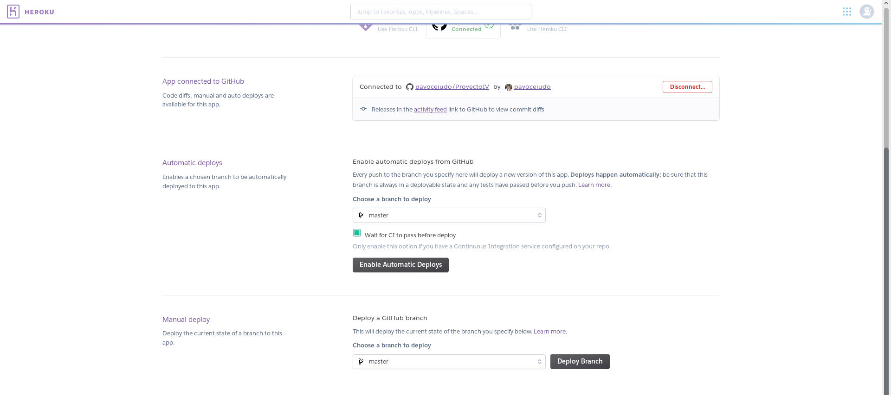

# gAcademy

gAcademy es un proyecto en el marco de la asignatura Infraestructuras Virtuales de la UGR. gAcademy nace para ser una herramienta basada en microservicios para ser utilizada en proyectos de gestión de alumnos y profesores en el ámbito académico.
La idea principal es cambiar (y facilitar) la gestión de una academia donde hasta dar de alta un alumno puede ser una tarea tediosa. Los microservicios que incluirá este proyecto serán, entre otros, la creación de nuevos alumnos y profesores, asignación de grupos tanto a alumnos como a profesores y la gestión de horarios de aulas y grupos.


## Servicios del proyecto

| Lenguaje | Base de datos | Infraestructura | IC |
| -------- | ------------- | --------------- | -- |
| [Nodejs](https://nodejs.org/en/)  [Express.js](https://expressjs.com/)|[Mongodb](https://www.mongodb.com/es) | [Heroku](https://www.heroku.com/) | [Travis](https://travis-ci.org/) |

En el desarrollo de gAcademy emplearé Nodejs como lenguaje principal para el servidor ya que permite llamadas asíncronas y parte de la idea de hacer aplicaciones escalables. Para la realización de la API emplearé Expressjs, framework de Nodejs que facilita mucho la tarea para las operaciones CRUD (Create Read Update Delete). Pero todo este desarrollo no puede ir solo, necesita de unos test que permitan automatizar si los cambios realizados son correctos. Travis es una herramienta muy popular entre los desarrollados para la integración continua ya que se configura directamente con GitHub resultando mucho más cómodo.  

## Despliegue

Despliegue en [https://gacademy.herokuapp.com/](https://gacademy.herokuapp.com/)

El despliegue de la aplicación se ha realizado en Heroku. El uso de Heroku es debido a que se puede comenzar con una cuenta gratuita y en caso de querer ampliar las prestaciones
del servidor se puede contratar según las necesidades de la aplicación(dynos). Además Heroku proporciona un toolbet muy bien adaptado para trabajar con aplicaciones NodeJs.

Para configurar Heroku he realizado las configuraciones descritas [aquí](https://devcenter.heroku.com/articles/getting-started-with-nodejs#set-up).

Los pasos seguidos sigue el siguiente orden:
1. Crear fichero Procfile con la ruta que va a utilizar Heroku para ejecutar la aplicación.
2. De igual manera, se lo especifico en el fichero package.json en la sección script.
3. Creamos la aplicación en Heroku utilizando su Toolbet:

	3.1 Generamos la aplicación: ```heroku apps:create --region eu gacademy```

	3.2 Probamos que todo funciona: ```heroku local web```

	3.3 Si todo funciona correctamente, podemos subirlo a Git ```git push heroku master```
4. Podemos acceder a [https://gacademy.herokuapp.com/](https://gacademy.herokuapp.com/) para comprobar que todo funcione correcto.

5. Para realizar el despliegue automático entramos al panel de configuración de la aplicación en Heroku. En la pestaña _Deploy_ conectamos la aplicación a GitHub (si no está conectada), seleccionamos la rama de donde queremos desplegar la aplicación, se marca la casilla de _"Wait for CI to pass before deploy"_ para indicar que queremos hacer el despliegue si los test se cumplen. En la siguiente imagen vemos como queda configurado: 
