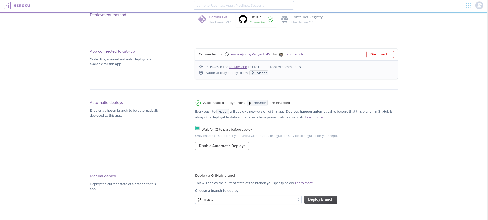

# gAcademy

gAcademy es un proyecto en el marco de la asignatura Infraestructuras Virtuales de la UGR. gAcademy nace para ser una herramienta basada en microservicios para ser utilizada en proyectos de gestión de alumnos y profesores en el ámbito académico.
La idea principal es cambiar (y facilitar) la gestión de una academia donde hasta dar de alta un alumno puede ser una tarea tediosa. Los microservicios que incluirá este proyecto serán, entre otros, la creación de nuevos alumnos y profesores, asignación de grupos tanto a alumnos como a profesores y la gestión de horarios de aulas y grupos.


## Servicios del proyecto

| Lenguaje | Base de datos | Infraestructura | IC |
| -------- | ------------- | --------------- | -- |
| [Nodejs](https://nodejs.org/en/)  [Express.js](https://expressjs.com/)|[Mongodb](https://www.mongodb.com/es) | [Heroku](https://www.heroku.com/) | [Travis](https://travis-ci.org/) |

En el desarrollo de gAcademy emplearé Nodejs como lenguaje principal para el servidor ya que permite llamadas asíncronas y parte de la idea de hacer aplicaciones escalables. Para la realización de la API emplearé Expressjs, framework de Nodejs que facilita mucho la tarea para las operaciones CRUD (Create Read Update Delete). Pero todo este desarrollo no puede ir solo, necesita de unos test que permitan automatizar si los cambios realizados son correctos. Travis es una herramienta muy popular entre los desarrollados para la integración continua ya que se configura directamente con GitHub resultando mucho más cómodo.  

## Despliegue

Despliegue en [https://gacademy.herokuapp.com/](https://gacademy.herokuapp.com/)

El despliegue de la aplicación se ha realizado en Heroku. El uso de Heroku es debido a que se puede comenzar con una cuenta gratuita y en caso de querer ampliar las prestaciones
del servidor se puede contratar según las necesidades de la aplicación(dynos). Además Heroku proporciona un toolbet muy bien adaptado para trabajar con aplicaciones NodeJs.

Para configurar Heroku he realizado las configuraciones descritas [aquí](https://devcenter.heroku.com/articles/getting-started-with-nodejs#set-up).

Los pasos seguidos siguen el siguiente orden:
1. Crear fichero Procfile con la ruta que va a utilizar Heroku para ejecutar la aplicación.
2. De igual manera, se lo especifico en el fichero package.json en la sección script.
3. Creamos la aplicación en Heroku utilizando su Toolbet:

	3.1 Generamos la aplicación: ```heroku apps:create --region eu gacademy```

	3.2 Probamos que todo funciona: ```heroku local web```

	3.3 Si todo funciona correctamente, podemos subirlo a Git ```git push heroku master```
4. Podemos acceder a [https://gacademy.herokuapp.com/](https://gacademy.herokuapp.com/) para comprobar que todo funcione correcto.

5. Para realizar el despliegue automático entramos al panel de configuración de la aplicación en Heroku. En la pestaña _Deploy_ conectamos la aplicación a GitHub (si no está conectada), seleccionamos la rama de donde queremos desplegar la aplicación, se marca la casilla de _"Wait for CI to pass before deploy"_ para indicar que queremos hacer el despliegue si los test se cumplen. En la siguiente imagen vemos como queda configurado: 

6. Una vez que la aplicación está alojada en Heroku, para ejecutarla necesitamos de un fichero llamado [_Procfile_](https://github.com/pavocejudo/ProyectoIV/blob/master/Procfile) que le va a indicar a nuestro dynos en Heroku que comando debe ejecutar para lanzar nuestra aplicación web, en mi caso, al ser una aplicación nodejs, el comando es ```node src/app.js```.

## Probando la aplicación
[https://gacademy.herokuapp.com/student/all](https://gacademy.herokuapp.com/student/all)

El resultado es:


[https://gacademy.herokuapp.com/subject/IV](https://gacademy.herokuapp.com/subject/IV)

El resultado es:


## Despliegue mediante contenedor

Para poder desplegar nuestra aplicación mediante un contenedor, vamos a necesitar tener instalado [Docker](https://www.docker.com/).

Una vez instalado, creamos nuestro archivo Dockerfile. Este archivo nos permitirá especificar al contenedor qué tendrá, además de definir variables de entorno, configurar puertos para nuestra aplicación y establecer las rutas para ejecutar el proyecto.

Para generar el contenedor utilizamos:

```
docker build -t pavocejudo/gacademy-node .
```

Una vez que esté creado, podemos subirlo a [DockerHub](https://hub.docker.com/r/pavocejudo/proyectoiv) mediante los comandos (una vez nos hemos registrado en docker mediante ```docker login```):

```
 docker tag gAcademy pavocejudo/gacademy-node:latest

 docker push pavocejudo/gacademy-node:latest
```

Por otro lado, he configurado otro contenedor para que se actualice automáticamente conforme se hacen push en el proyecto de GitHub. Para ello, en nuestra cuenta de DockerHub, entramos en ```Create > Create Automatic Build``` y seleccionamos nuestro repositorio de Github.

## Despliegue en IaaS

### Creación y provisionamieno de la aplicación
Para el despliegue de la aplicación he utilizado los servidores de Digital Ocean ya que nos dan 50$ de crédito con la cuenta de GitHub Student, además de su bajo coste y sus buenas prestaciones. Por tanto, he creado una cuenta en dicha web y he generado un token de acceso para la API:


Para realizar el despliegue se debe primero instalar Vagrant y configurar el archivo [Vagrantfile](https://github.com/pavocejudo/ProyectoIV/blob/master/Vagrantfile) para su configuración. Mediante el uso de ```vagrant init``` nos genera un fichero Vagrantfile, pero recomiendo consultar su [documentación oficial](https://www.vagrantup.com/docs/vagrantfile/machine_settings.html) para configurarlo.

Al querer desplegar la aplicación en Digital Ocean, podemos seguir los pasos del tutorial [oficial proporcionado por Digital Ocean](https://www.digitalocean.com/community/tutorials/how-to-use-digitalocean-as-your-provider-in-vagrant-on-an-ubuntu-12-10-vps).
En resumen, hay que descargar el box que proporciona la web, generar un par de claves SSH y configurar el vagrantfile antes mencionado. 

Para descargar el box hay que ejecutar: 
```
vagrant plugin install vagrant-digitalocean
```


 y a continuación le indicamos a Vagrant que lo vamos a usar, aunque este paso es opcional ya que lo configuraré en el Vagrantfile para utilizarlo en caso de no tenerlo descargado,
 ```
 vagrant box add digital_ocean https://github.com/smdahlen/vagrant-digitalocean/raw/master/box/digital_ocean.box
 ```

 La generación de claves SSH se realiza ejecutando el siguiente comando. Estas se almacenan en *~/.ssh/id_rsa* y  *~/.ssh/id_rsa.pub*.
 ```
 ssh-keygen -t rsa
 ```

Una vez listo estos pasos, creamos un archivo Vagrantfile o, si hemos seguido el tutorial de Digital Ocean, modificaremos este archivo para configurarlo a nuestro gusto. En el propio fichero he comentado sentencia a sentencia para qué es empleada cada ajuste, pero a grandes rasgos, los ajustes a destacar son:

- *override.vm.box_url = "https://github.com/devopsgroup-io/vagrant-digitalocean/raw/master/box/digital_ocean.box"* -> Se utiliza para, en el caso de no tener el box de Digital Ocean descargado, descargarlo.
- *provider.token = ENV['DIGITAL_OCEAN_API']* -> Token de acceso, antes generado, para la API de Digital Ocean , la cual permite gestionar [*Droplets*](https://www.digitalocean.com/products/droplets/) sin tener que entrar en la web. Este dato lo he almacenado en las variables de entorno del sistema por temas de seguridad. En el caso de tener un token de acceso, realizad ```export DIGITAL_OCEAN_API=<token>```


En este punto ya tenemos configurado nuestro *"provider"* y si realizamos ```vagrant up``` nos debe generar un droplet. En la siguiente imagen podemos ver el resultado desde la web:


Pasamos a configurar Ansible para poder instalar en nuestro box los paquetes y programas que usaremos para nuestra aplicación.
En el archivo Vagrantfile añadimos la configuración para el provisionamiento (*provision*), que en este caso solo hemos de indicarle dónde se encuentra nuestro archivo [*playbook.yml*](https://github.com/pavocejudo/ProyectoIV/blob/master/provision/playbook.yml). Este archivo contiene la estructura de datos que necesita Ansible para ejecutar/instalar los comandos que le indiquemos. En mi caso, he permitido que se ejecute para todos los host ya que solo tenemos uno (el box de Digital Ocean). Las tareas que va a realizar al provisionar la máquina es: 

1. Actualizar los paquetes instalados
2. Instalar node js
3. Instalar npm
4. Clonar el repositorio de nuestra aplicación
5. Instalar las dependencias que tengamos en el [package.json](https://github.com/pavocejudo/ProyectoIV/blob/master/package.json) utilizando npm
6. Establecer una variable de entorno que necesitaremos en nuestra aplicación (el puerto en el que se va a servir)

Para las 3 primeras tareas vamos a necesitar ser root, por ello se añade el parametro ```become: yes```. El parámetro *state* en el parámetro *apt* indica que si está instalado, no haga nada y continúa por la siguiente tarea.

En la tarea 4, se le indica mediante *dest* dónde descargar el proyecto, esta tarea sería el equivalente de ejecutar ```git clone git@github.com:usuario/proyecto.git carpeta```.
Algo parecido indica el parámetro *path* en *npm*, establece dónde se van a instalar los paquetes de la aplicación. Se podría indicar el parámetro *name* dentro de *npm* para instalar un paquete en concreto. Si no se encuentra este parámetro, instala los paquetes de package.json.

Volviendo al archivo Vagrantfile, en la configuración de Ansible encontramos dos líneas más: *ansible.become = true* y *ansible.verbose = "vv"*. La primera indica que se puedan ejecutar tareas en modo root y la segunda indica el nivel de explicación que queremos en el momento en el que ejecutemos vagrant.


LLegados a este nivel, ejecutamos ```vagrant provision``` (si habíamos ejecutado ```vagrant up```) y nos ejecutará todas las tareas que hemos indicado en el archivo *playbook.yml*. Si no hemos ejecutado ```vagrant up```, lo podemos ejecutar y se realizará el provisionamiento también.

### Herramienta de despliegue: Flightplan

Para poder instalar nuestra aplicación, ejecutarla o pararla sin necesitar entrar a nuestro sistema o mediante terminal, podemos utilizar herramientas diseñadas para que, mediante un script, ejecutemos las sentencias que queramos. En este caso, al estar trabajando con JavaScript me ha parecio lo más acertado seguir trabajando con este lenguaje. Existe una paquete nodejs diseñado para este propósito. Se trata de [FlightPlan](https://www.npmjs.com/package/flightplan) y nos permite ejecutar comandos tanto para una máquina local como remota.

Para instalar este paquete solo necesitamos tener instalado ```node``` y ```npm``` y la instalación se realiza simplemente ejecutando ```npm install -g flightplan``` como bien explican en su documentación.

Una vez instalado, debemos crear el archivo que contendrá los credenciales de acceso a la máquina y los comandos que queremos ejecutar. Este archivo se llama ```flightplan.js```, que podemos encontrar [aquí](https://github.com/pavocejudo/ProyectoIV/blob/master/despliegue/flightplan.js) para nuestro proyecto.

La primera línea de este archivo es incluir el paquete flightplan.

El siguiente bloque es definir a qué máquina o máquinas queremos afectar (*target*) con nuestros comandos. Para ello definimos un nombre para nuestra máquina, en este caso '*despliegue*' y le proporcionamos las credenciales para conectarse: una ip, el usuario con el que queremos loguearnos y le damos la ruta de las claves rsa para conectaros vía SSH. Aquí podríamos definir más de una máquina para conectarnos y ejecutar todos los comandos a las distintas máquinas:
 ```
 plan.target('despliegue', [
 	{
		host: '174.138.2.199',
		username: 'root',
		agent: process.env.SSH_AUTH_SOCK
	}]
 );
 ```

El siguiente paso es definir los comandos que queremos ejecutar en nuestra máquina remota. Para ello utilizamos la función ```remote``` (o ```local``` si queremos que afecte a una máquina local previamente definida), le proporcionamos un nombre para este comando, aunque es opcional, y le indicamos las acciones a realizar:

```
plan.remote(['install'],function(remote){
	remote.log('Installing dependecies');
	remote.with('cd ~/proyecto/', function(){
		remote.exec('npm install');

	});
});
```
En este bloque vemos que he definido el comando "*install*", el cual afecta a una máquina *remota*. Lo primero que realiza es mostrar el mensaje "Installing dependecies" Acto seguido, se cambia de directorio a la carpeta *proyecto* y ejecuta la instalación de las dependencias de nuestra aplicación (las definidas en el archivo package.json)


Una vez definidos todos nuestros comandos, es momento de ejecutarlos.
Para ello ejecutamos ```fly <instruccion>:despliegue```. Esto ejecutará ```instruccion``` en la máquina ```despliegue```. Si no hemos definido los nombres de los comandos se ejecutarán todos seguidos aunque en el momento en que falle uno, no continuará por el siguiente.

Como en nuestra aplicación, el archivo se encuentra en una ruta distinta de la ruta principal de la aplicación, con el parámetro ```-f ``` podemos indicarle que archivo flightplan usar, resultando la ejecución, para el comando *exec*, por ejemplo, de la siguiente manera:
```
fly exec:despliegue -f despliegue/flightplan.js
```


Para comprobar si nuestra aplicación se ha desplegado correctamente, entramos en su IP: [174.138.2.199](174.138.2.199)  y comprobamos que está en ejecución el servidor:

